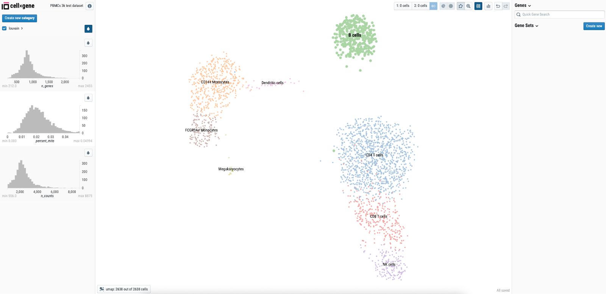

# CellxGene Example

This example contains a Dockerfile that builds a container image for running CellxGene with Seqera Studios.



## Docker Image

The container image is available at:
```
ghcr.io/seqeralabs/custom-studios-examples/cellxgene:latest
```

For specific versions, use the release tag (e.g., `ghcr.io/seqeralabs/custom-studios-examples/cellxgene:v1.0.0`).

## Features

- CellxGene 1.3.0 visualization platform
- Support for .h5ad datasets
- Compatible with both local Docker testing and Seqera Studios
- Automatic data mounting via datalinks

## Files

- `Dockerfile`: Container definition using multi-stage build
- `pbmc3k.h5ad`: Example dataset (mounted via datalink)

## Local Testing

To test the app locally for testing purposes you need to override the entrypoint:

```bash
docker build --platform=linux/amd64 -t cellxgene-example .
docker run -p 3000:3000 --entrypoint /usr/local/bin/cellxgene cellxgene-example launch \
    --host 0.0.0.0 \
    --port 3000 \
    --user-generated-data-dir /user-data/cellxgene \
    --annotations-dir /user-data/cellxgene \
    --title "PBMCs 3k test dataset" \
    /path/to/your/dataset.h5ad
```

To point at a specific data file rather than the input example, make it available at /workspace/data/cellxgene_datasets/ in the container. For example if your dataset was in the current directory:

```bash
docker run -p 3000:3000 --entrypoint /usr/local/bin/cellxgene -v $(pwd)/data:/workspace/data/cellxgene_datasets cellxgene-example launch \
    --host 0.0.0.0 \
    --port 3000 \
    --user-generated-data-dir /user-data/cellxgene \
    --annotations-dir /user-data/cellxgene \
    --title "Your Dataset" \
    /workspace/data/cellxgene_datasets/your_dataset.h5ad
```

The app will be available at http://localhost:3000

## Usage in Seqera Studios

To use this app in Seqera Studios:

Create a data link called 'cellxgene_datasets' and place your .h5ad file there.

1. Select the **Studios** tab in your workspace
2. Click **Add Studio**
3. In the **General config** section:
   - Select **Prebuilt container image** as the container template
   - Enter your container image URI, for example: `cr.seqera.io/scidev/cellxgene-example`
   - Set a **Studio name** and optional **Description**
4. Configure compute resources in the **Compute and Data** section:
   - Select your compute environment
   - Adjust CPU, GPU, and memory allocations as needed
   - Mount your .h5ad dataset using the **Mount data** option
5. Review the configuration in the **Summary** section
6. Click **Add and start** to create and launch the Studio

## Notes

- The app uses CellxGene 1.3.0 for interactive single-cell data visualization
- The Dockerfile uses a multi-stage build to include the connect-client
- The container is built for linux/amd64 platform compatibility
- User data and annotations are stored in /user-data/cellxgene
- The default dataset is pbmc3k.h5ad, but can be changed via the DATASET_NAME environment variable