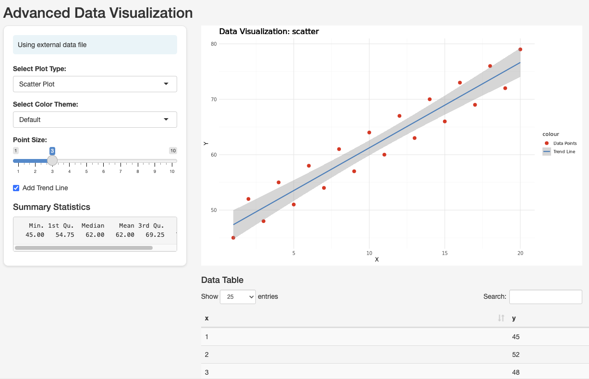

# Shiny Studio Environment

This example provides a custom container image for running a [R Shiny](https://shiny.rstudio.com/) application in Seqera Platform, demonstrating interactive data visualization capabilities.

## Table of Contents

- [Overview](#overview)
- [Features](#features)
- [Files](#files)
- [Prerequisites](#prerequisites)
- [Local Testing](#local-testing)
- [Using in Seqera Studios](#using-in-seqera-studios)
- [Notes](#notes)
- [References](#references)

## Overview

This container is designed for use as a [custom Studio environment](https://docs.seqera.io/platform-cloud/studios/custom-envs) in Seqera Platform. It provides a simple but powerful example of interactive data visualization using R Shiny.



## Docker Image

The container image is available at:
```
ghcr.io/seqeralabs/custom-studios-examples/shiny:latest
```

For specific versions, use the release tag (e.g., `ghcr.io/seqeralabs/custom-studios-examples/shiny:v1.0.0`).

## Features

- Simple scatter plot visualization
- Interactive data filtering
- Compatible with both local Docker testing and Seqera Studios
- Efficient package management with micromamba
- Easy data mounting via datalinks

## Files

- `app_plot_demo.R`: The main Shiny application
- `example_data.csv`: Sample data for the visualization
- `Dockerfile`: Container definition
- `run.sh`: Entrypoint script that handles both local and Studios environments

## Prerequisites

- [Docker](https://www.docker.com/) installed
- [Wave](https://docs.seqera.io/platform-cloud/wave/) configured in your Seqera Platform workspace
- Access to a container registry (public or Amazon ECR) if you wish to push your image
- R data files in CSV format

## Local Testing

To test the app locally:

```bash
docker build --platform=linux/amd64 -t shiny-simple-example .
docker run -p 3000:3000 --entrypoint micromamba shiny-simple-example run -n shiny R -e "shiny::runApp('/app/app_plot_demo.R', host='0.0.0.0', port=3000)"
```

To use a specific data file, make it available at /workspace/data/shiny-inputs/data.csv in the container:

```bash
docker run -p 3000:3000 --entrypoint micromamba -v $(pwd)/../data/shiny-inputs:/workspace/data/shiny-inputs shiny-simple-example run -n shiny R -e "shiny::runApp('/app/app_plot_demo.R', host='0.0.0.0', port=3000)"
```

The app will be available at http://localhost:3000

## Using in Seqera Studios

> [!NOTE]
> For the common deployment process, see the [main README](../README.md#deploying-to-seqera-studios).

Additional steps specific to this example:
1. Create a data link called 'shiny-inputs' and place your input file called 'data.csv' there
2. Follow the common deployment process
3. When mounting data, ensure to mount 'shiny-inputs' using the **Mount data** option

## Notes

- The app uses a simple scatter plot to demonstrate Shiny's capabilities
- The Dockerfile uses micromamba for efficient package management
- The container is built for linux/amd64 platform compatibility
- Data files should be in CSV format
- The example includes a sample dataset for demonstration

## References

- [Seqera Studios: Custom Environments](https://docs.seqera.io/platform-cloud/studios/custom-envs)
- [R Shiny Documentation](https://shiny.rstudio.com/)
- [Micromamba Documentation](https://mamba.readthedocs.io/)
- [Wave Documentation](https://docs.seqera.io/platform-cloud/wave/) 