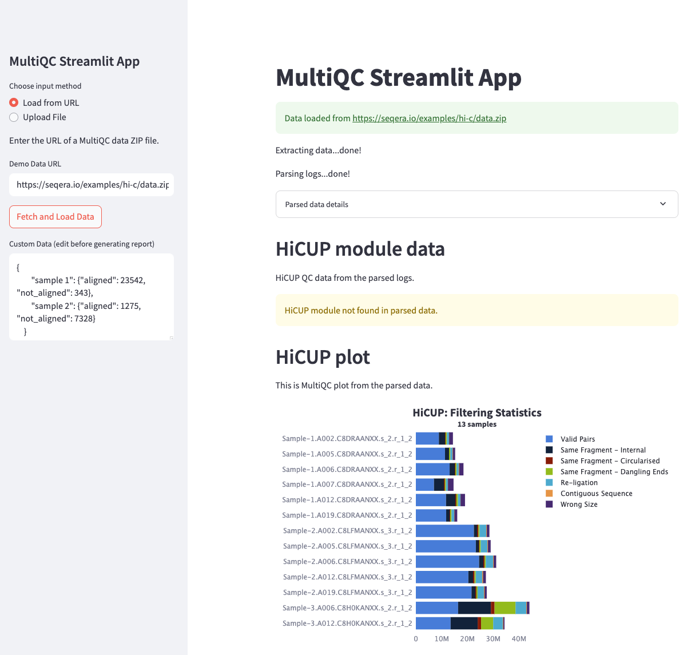

# Streamlit Studio Environment

This example provides a custom container image for running a [Streamlit](https://streamlit.io/) application with MultiQC visualization in Seqera Platform.

## Table of Contents

- [Overview](#overview)
- [Features](#features)
- [Files](#files)
- [Prerequisites](#prerequisites)
- [Local Testing](#local-testing)
- [Using in Seqera Studios](#using-in-seqera-studios)
- [Notes](#notes)
- [References](#references)

## Overview

This container is designed for use as a [custom Studio environment](https://docs.seqera.io/platform-cloud/studios/custom-envs) in Seqera Platform. It provides an interactive interface for visualizing MultiQC data using Streamlit.



## Docker Image

The container image is available at:
```
ghcr.io/seqeralabs/custom-studios-examples/streamlit:latest
```

For specific versions, use the release tag (e.g., `ghcr.io/seqeralabs/custom-studios-examples/streamlit:v1.0.0`).

## Features

- Streamlit-based MultiQC visualization platform
- Interactive data analysis and visualization
- Compatible with both local Docker testing and Seqera Studios
- Automatic data mounting via datalinks
- Python 3.11-based environment

## Files

- `Dockerfile`: Container definition using multi-stage build that clones the MultiQC example repository and its dependencies

## Prerequisites

- [Docker](https://www.docker.com/) installed
- [Wave](https://docs.seqera.io/platform-cloud/wave/) configured in your Seqera Platform workspace
- Access to a container registry (public or Amazon ECR) if you wish to push your image
- MultiQC data files for visualization

## Local Testing

To test the app locally:

```bash
docker build --platform=linux/amd64 -t streamlit-example .
docker run -p 3000:3000 --entrypoint streamlit streamlit-example run /app/multiqc_app.py \
    --server.port=3000 \
    --server.address=0.0.0.0 \
    --server.enableCORS=false \
    --server.enableXsrfProtection=false \
    --server.enableWebsocketCompression=false \
    --browser.gatherUsageStats=false
```

The app will be available at http://localhost:3000

## Using in Seqera Studios

> [!NOTE]
> For the common deployment process, see the [main README](../README.md#deploying-to-seqera-studios).

Additional steps specific to this example:
1. Follow the common deployment process
2. When mounting data, ensure to mount the directories containing any required MultiQC data files using the **Mount data** option

### Data Loading Options

The MultiQC Streamlit app supports three data loading methods:
- **URL**: Load data directly from a web URL
- **Local Files**: Access files from your local machine
- **Server Paths**: Load files from S3 via Fusion

When using Server Paths with data links:
1. Upload your MultiQC data (e.g., `data.zip`) to your S3 bucket
2. Create a data link (e.g., `my_multiqc_files`) pointing to that S3 path
3. The data will be available at `/workspace/data/my_multiqc_files/data.zip`
4. Use this path in the app's "Server Path" input field

## Notes

- The app uses Streamlit for interactive data visualization
- The Dockerfile uses a multi-stage build to include the connect-client
- The container is built for linux/amd64 platform compatibility
- The example is based on the MultiQC Streamlit application
- The container uses Python 3.11 as the base image

## References

- [Seqera Studios: Custom Environments](https://docs.seqera.io/platform-cloud/studios/custom-envs)
- [Streamlit Documentation](https://docs.streamlit.io/)
- [MultiQC Documentation](https://multiqc.info/)
- [Wave Documentation](https://docs.seqera.io/platform-cloud/wave/) 