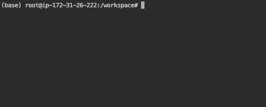

# TTYD Terminal Example

This example contains a Dockerfile that builds a container image for running an interactive terminal session in Seqera Studios using TTYD.



## Features

- Interactive web-based terminal using TTYD 1.7.7
- Based on SAMtools 1.21 container
- Compatible with both local Docker testing and Seqera Studios
- Full terminal access with write permissions
- Includes basic bioinformatics tools from SAMtools

## Files

- `Dockerfile`: Container definition using multi-stage build
- `screenshot.png`: Screenshot of the terminal interface (to be added)

## Local Testing

To test the terminal locally for testing purposes you need to override the entrypoint:

```bash
docker build --platform=linux/amd64 -t ttyd-example .
docker run -p 3000:3000 --entrypoint ttyd ttyd-example -W -p 3000 bash
```

The terminal will be available at http://localhost:3000

## Usage in Seqera Studios

To use this terminal in Seqera Studios:

1. Select the **Studios** tab in your workspace
2. Click **Add Studio**
3. In the **General config** section:
   - Select **Prebuilt container image** as the container template
   - Enter your container image URI, for example: `cr.seqera.io/scidev/ttyd-example`
   - Set a **Studio name** and optional **Description**
4. Configure compute resources in the **Compute and Data** section:
   - Select your compute environment
   - Adjust CPU, GPU, and memory allocations as needed
   - Mount any required data using the **Mount data** option
5. Review the configuration in the **Summary** section
6. Click **Add and start** to create and launch the Studio

## Notes

- The terminal uses TTYD 1.7.7 for web-based terminal access
- The Dockerfile uses a multi-stage build to include the connect-client
- The container is built for linux/amd64 platform compatibility
- The terminal runs with write permissions enabled (-W flag)
- The base image includes SAMtools 1.21 and other bioinformatics tools
- The port is automatically configured via the CONNECT_TOOL_PORT environment variable in Studios 